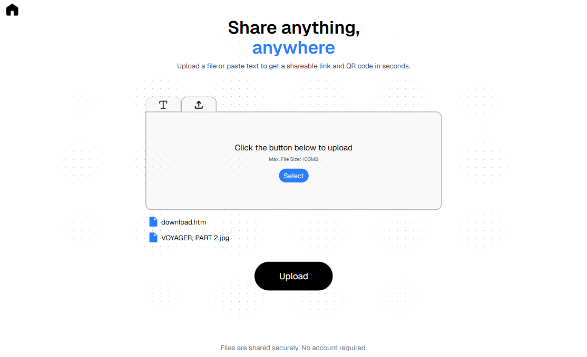
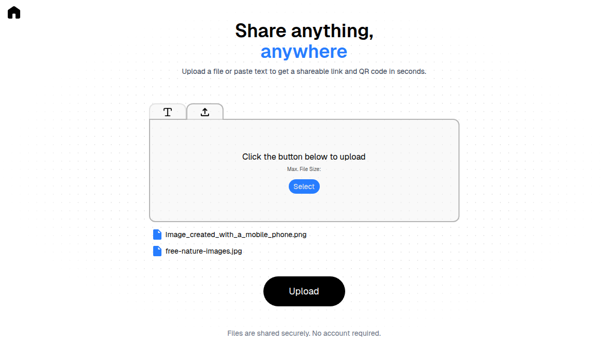
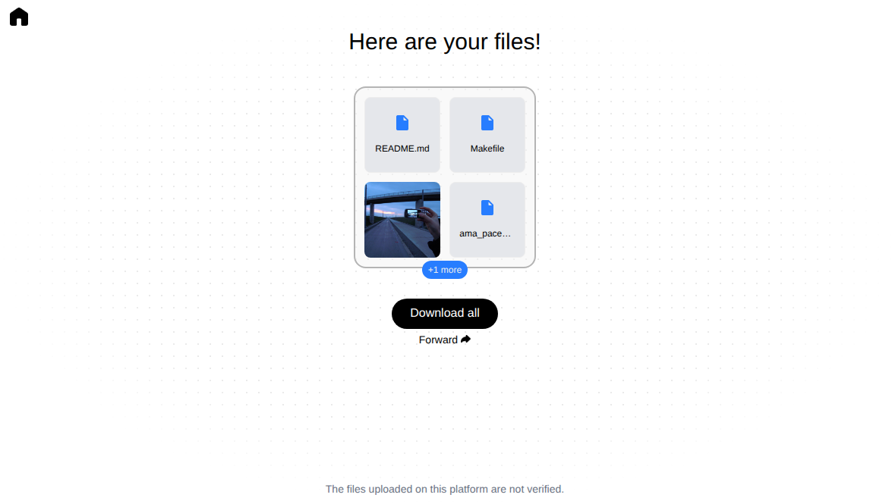

# Airfile

Airfile is a simple and modern file-sharing application that allows users to upload, share, and access files easily through a clean web interface.

## ✨ Features

* 📤 Upload files securely
* 🔗 Share files via a generated link or QR code
* ⏱️ File expiration after a defined time
* 📏 File size limit
* 💻 Responsive and user-friendly interface

## 🛠️ Tech Stack

* **Frontend**: Next.js, React, Tailwind CSS
* **Backend**: Node.js
* **Containerization**: Docker & Docker Compose

## 🚀 Getting Started

### Prerequisites

Make sure you have the following installed:

* Make
* Docker
* Docker Compose

### Installation

Clone the repository:

```bash
git clone https://github.com/noanjrd/Airfile.git
cd Airfile
```

### Environment Variables

Create a ```.env.local``` file in the ```src``` folder of the project.

Variables to configure
```
NEXT_PUBLIC_URL_SITE=YOUR_SITE_URL
NEXT_PUBLIC_MAX_SIZE_FILES_BYTES=MAX_FILE_SIZE_IN_BYTES
NEXT_PUBLIC_EXPIRATION_FILES=FILE_EXPIRATION_TIME_IN_MS
NEXT_PUBLIC_MAX_SIZE_FILES=MAX_FILE_SIZE_IN_STR
```

Example configuration
```
NEXT_PUBLIC_URL_SITE=http://localhost:3000
NEXT_PUBLIC_MAX_SIZE_FILES_BYTES=104857600
NEXT_PUBLIC_EXPIRATION_FILES=3600000
NEXT_PUBLIC_MAX_SIZE_FILES=100MB
```

### Run with Docker

Build and start the containers:

```bash
make build
make start
```

Or manually:

```bash
docker compose build
docker compose up
```

Then open your browser at:

```
http://localhost:3000
```

## 📸 Preview





## 🧪 Development

To run the project in development mode without Docker:

```bash
cd src
npm install
npm run dev
```

## 🧑‍💻 Author

* **Noan Jard**

